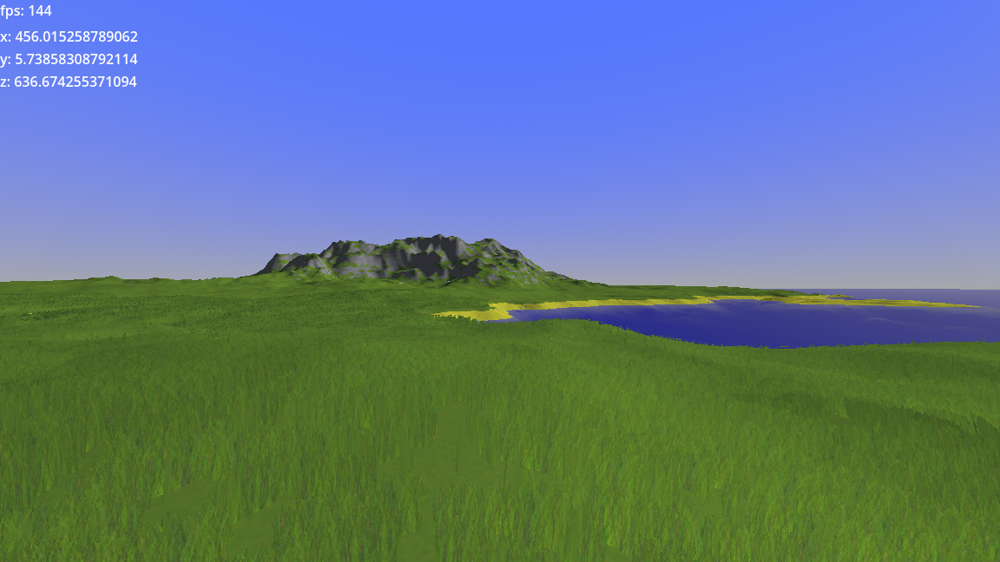

# 3D procedural large open world experiments

Trying to build a heightmap terrain system.

Built in [Godot 4.0 rc 3](https://godotengine.org/article/release-candidate-godot-4-0-rc-3/#downloads) (and will likely update with the most recent 4.0 version that's available).

## Structure

The world consists of multiple components
Most components should get their update_viewpoint called with the new viewpoint when the viewpoint changes (for example because the player moves)

### Blueprint

The blueprint defines what the shape of the heightmap should be. It is the source of information for all other components.
The other components should get the blueprint as their source property

## HeightMesh

The HeighMesh is showing the heightmap itself.

## HeightCollisiton

Does the physical collisions

## HeightGrass

The HeightGrass component can draw a lot of small meshes (like grass) on the heightmap
